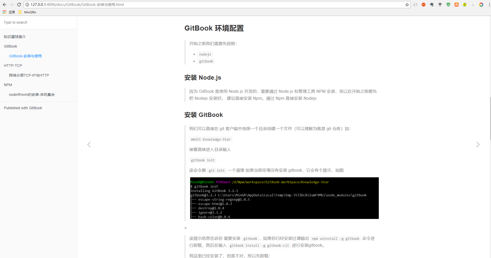

# Knowledge-Star

> `Knowledge-Star` 作为知识星球是笔者用于写作使用的，是本 GitBook。请使用 GitBook 方式打开该笔记！
> 作为一名大白，笔者之前一直使用 博客、印象笔记等记录写自己觉得有必要要记录的知识点。
>
> 因为各大网站的博客各不相同，而且，一旦文章记录多的话又不好管理。总是出现一种情况：想找某个知识点，只记得在某某分类下，但就是找不到。当不需要的时候却又突然出现。原因就是文章分类让人混乱
>
>而 gitbook 的不同之处在于他是本书，只需要给每一章没一个知识点设定一个目录即可，便于查找分页。而且，只需要将本仓库拷贝至本地通过 `gitbook命令运行` 就能直接在网页打开，十分方便。
>
>