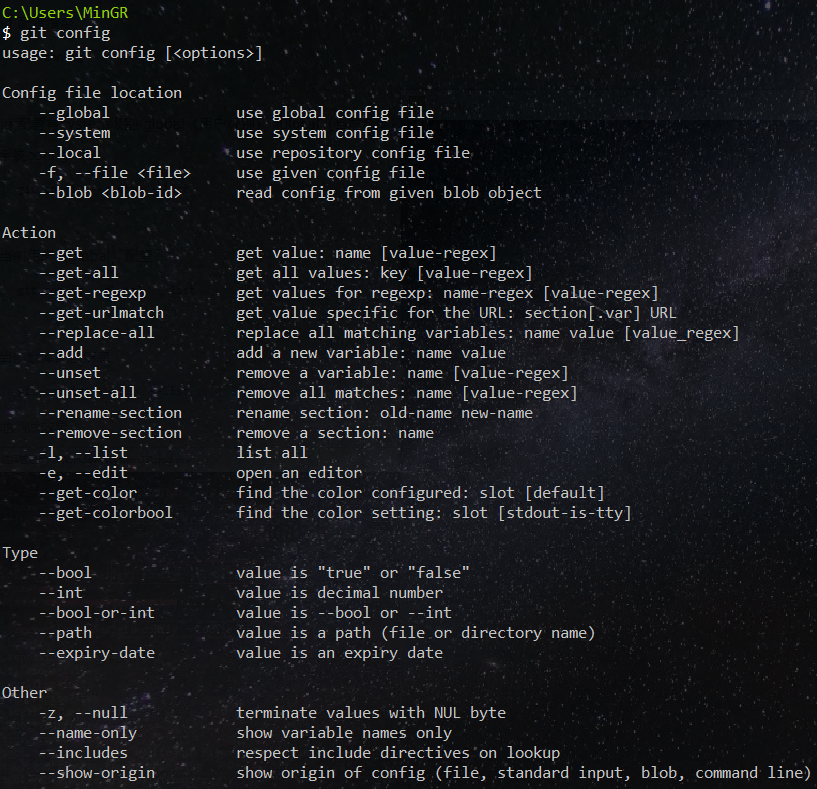
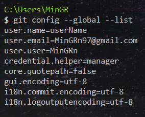
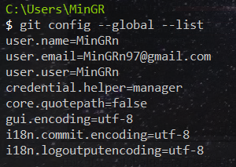

# git 安装

# git config 配置命令

```
git config
```

该命令用户查看配置，显示如下：



git config 配置有 system级别、global(用户)级别和 local(当前仓库)级别。优先级为 system > global > local，底层配置会覆盖顶层配置。如在当前仓库配置 `user.name: localUserName`，在 global级别配置的为 `user.name: globalUserName` 在提交代码时显示的用户为 `localUserName`。

查看系统 config：

```
git config --system --list
```

查看当前用户(global) config：

```
git config --global --list
```

以 `global` 级别为例：



可以看到 `user.name` 为 `userName`。如果想修改该配置命令如下：

```
git config --global user.name "MinGRn"
```

再次查看：



可以看到 `user.name` 成功被修改为 `MinGRn`
