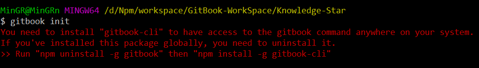
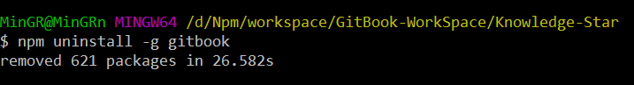
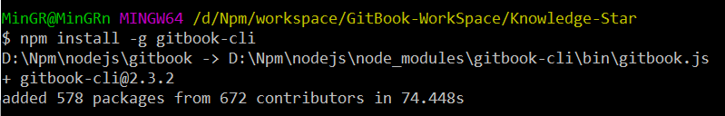
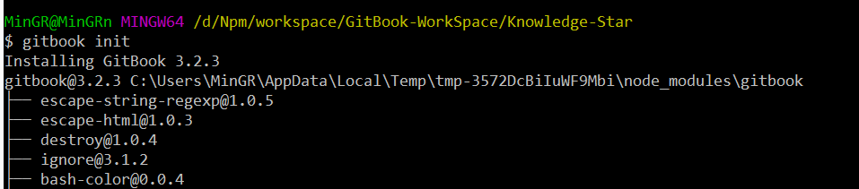
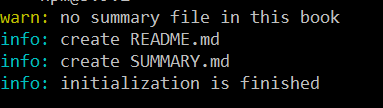
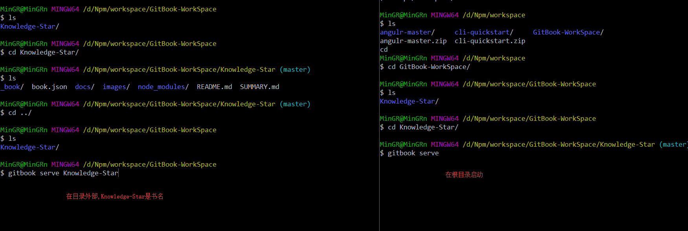
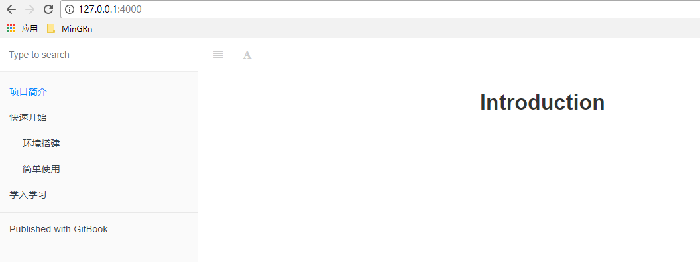

<!-- TOC depthFrom:1 depthTo:6 withLinks:1 updateOnSave:1 orderedList:0 -->

* [GitBook 安装与使用](#gitbook-安装与使用)
	+ [前言](#前言)
		- [GitBook 是什么 ？](#gitbook-是什么-)
		- [为什么要使用 GitBook ?](#为什么要使用-gitbook-)
		- [GitBook 功能](#gitbook-功能)
		- [GitBook 工具组合](#gitbook-工具组合)
		- [GitBook 使用场景](#gitbook-使用场景)
	+ [GitBook 环境配置](#gitbook-环境配置)
		- [安装 Node.js](#安装-nodejs)
		- [安装 GitBook](#安装-gitbook)
		- [定义目录结构](#定义目录结构)
	+ [启动服务](#启动服务)
		- [启动服务命令](#启动服务命令)
		- [改变默认服务端口](#改变默认服务端口)
		- [查看页面效果](#查看页面效果)
	+ [资料汇总](#资料汇总)
<!-- /TOC -->

# GitBook 安装与使用

## 前言
### GitBook 是什么 ？
> GitBook是一个基于 Node.js 的命令行工具，可使用 Github/Git 和 Markdown 来制作精美的电子书，GitBook 并非关于 Git 的教程。
> GitBook 是目前最流行的开源书籍写作方案。

### 为什么要使用 GitBook ?
>  确实，在这个各种编辑器和博客横飞的年代（比如简书），GitBook有什么优势呢？
>  - GitBook 支持多种编辑格式，如 MarkDown
>  - 支持对人同时在线编辑
>  - GitBook 可以让创作者专注写作，自由的挥洒，不必太多的关心内容排版、发布和版本管理等问题。
>  - 除了通过 GitBook 命令行管理电子书外，还可以在线（gitbook.com）或者使用桌面编辑器 Gitbook Editor 来编写和管理电子书

### GitBook 功能
> - 支持 Markdown 或 AsciiDoc 语法
> - 可导出静态站点或电子书（PDF、epub、mobi）
> - 支持多语言
> - 可设置封面
> - 支持变量、模板和模板继承
> - 有丰富的插件

### GitBook 工具组合
> - `Node.js` ：为了使用 npm 安装 GitBook，一定要先安装 Node.js
> - `GitBook 命令` ：基于 Node.js 开发的命令行工具，用于创建和管理电子书
> - `Markdown` ：GitBook 使用 Markdown 来写作，作者再也不用担心排版了
> - `Git` ：GitBook 使用 Git 管理写作内容，方便多人协作和版本管理
> - `Github/Gitlab` ：跟代码一样，写作的内容可以托管在 Github 或 Gitlab 中
> - `gitbook.com` ：用于在线编写、发布和托管电子书的网站

### GitBook 使用场景
> - 搭建公司内部的文档平台，用于公司内部的资料共享
> - 发表开源的电子书，用于在互联网上共享自己的知识，普惠大众

## GitBook 环境配置
> 开始之前我们需要先按照：
> - `nodejs`
> - `gitbook`

### 安装 Node.js
> 因为 GitBook 是使用 Node.js 开发的，需要通过 Node.js 包管理工具 NPM 安装，所以在开始之前要先把 Nodejs 安装好。
> 建议直接安装 Npm(如何安装请阅读**node中nvm的安装-采坑集合**)。通过 Npm 直接安装 Nodejs

### 安装 GitBook
> 我们可以直接在 git 客户端中选择一个目录创建一个文件（可以理解为就是 git 仓库）如：
>
> `mkdit Knowledge-Star`
>
> 接着直接进入目录输入
>
> `gitbook init`
>
> 该命令跟 `git init` 一个道理
> 如果当前环境没有安装 gitbook，它会有个提示，如图
>
> 
>
>
> 该提示信息告诉你 需要安装 `gitbook`，如果你已经安装过请输出 `npm uninstall -g gitbook` 命令进行卸载，然后在输入 `gitbook install -g gitbook-cli` 进行安装gitbook。
>
> 我这里已经安装了，但是不对，所以先卸载：
>
> 
>
>接着在进行安装
>
>
>
> 安装成功后再进行 初始化
>
> 
>
> 初始化仓库成功后悔看到如下信息
>
> 
>
> - README.md - 项目的介绍都写在这个文件里
> - SUMMARY.md - GitBook 的目录结构在这里配置

### 定义目录结构
> 在 SUMMARY.md 文件中定义目录结构有两种方法

> 方法 ➊. 先定义好目录结构，通过 gitbook init 自动生成目录结构对应的文件夹和 Markdown 文件。

> 方法 ➋. 先创建好文件夹和 Markdown 文件再来编辑目录结构。

> **SUMMARY.md**

> SUMMARY.md 的目录结构长什么样？ 看下面：

```
# Summary

* [项目简介](README.md)
* [快速开始](docs/快速开始.md)
 * [环境搭建](docs/环境搭建.md)
 * [简单使用](docs/简单使用.md)
* [学入学习](docs/深入学习.md)
```

> 这个目录建好以后在根目录下执行命令
>
> `gitbook init`
>
> 那些没有的目录和文件都会被创建
```
info: create docs/快速开始.md
info: create docs/环境搭建.md
info: create docs/简单使用.md
info: create docs/深入学习.md
info: create SUMMARY.md
info: initialization is finished
```
> **注意： gitbook init 只支持生成两级目录**


## 启动服务

### 启动服务命令

> - 在根目录执行命令 `gitbook serve` 命令进行启动服务
> - 在跟目录外部执行命令 `gitbook serve booName` 命令进行启动服务
>
> **如图**
> 
>
>  **结果**
```
Live reload server started on port: 35729
Press CTRL+C to quit ...

info: 7 plugins are installed
info: loading plugin "livereload"... OK
info: loading plugin "highlight"... OK
info: loading plugin "search"... OK
info: loading plugin "lunr"... OK
info: loading plugin "sharing"... OK
info: loading plugin "fontsettings"... OK
info: loading plugin "theme-default"... OK
info: found 5 pages
info: found 0 asset files
info: >> generation finished with success in 1.9s !

Starting server ...
Serving book on http://localhost:4000 # 注意浏览地址
```
> 执行 gitbook serve命令后，会先编译书籍gitbook build，如果没有问题会打开一个 Web 服务器，默认监听 4000 端口。如果编译有问题，会抛出错误信息。

### 改变默认服务端口

> 如果我们要同时启动多个 gitbook 服务的话就需要改变 gitbook 默认web端口，同时也要改变 gitbook 默认进程端口
>
> - 默认web端口: 4000
> - 默认进程端口: 35729
>
> **命令**：
> `gitbook serve [bookName] --lrport pressPort --port webPort`
>
> 就前面的例子而言：
> - 在根目录： `gitbook serve --lrport 35728 --port 4001`
> - 在外部： `gitook serve Knowledge --lreport 35728 --port 4001`
> 在浏览器中输入 `127.0.0.1:4001` 即可访问

### 查看页面效果

> 安装之前的操作正常启动后，在浏览器中打开 `127.0.0.1:4000` 或 `localhost:4000` 查看书籍的效果
>
> 

## 资料汇总

> - [Jikai Zhang](http://www.zhangjikai.com/)
> - [ChengWei's GitBook 简明教程](http://www.chengweiyang.cn/gitbook/)
> - [GitBook Toolchain](https://toolchain.gitbook.com/)
