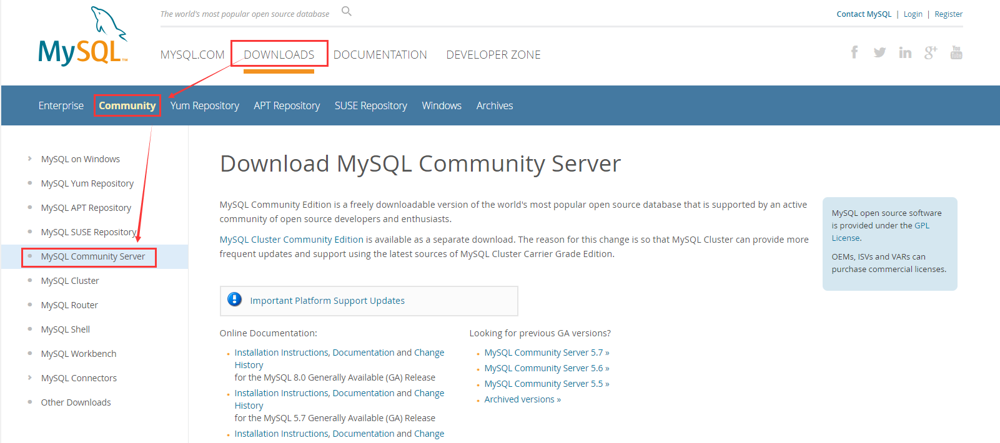
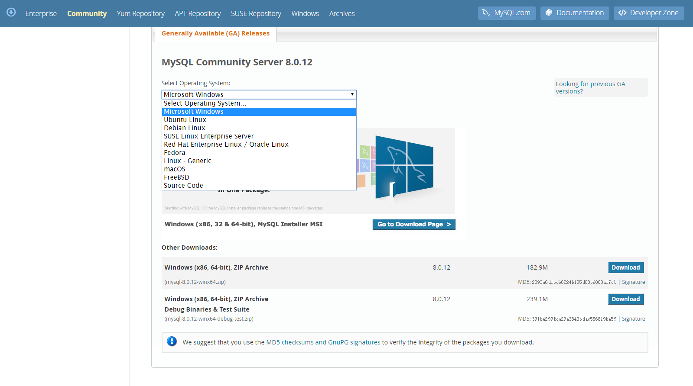
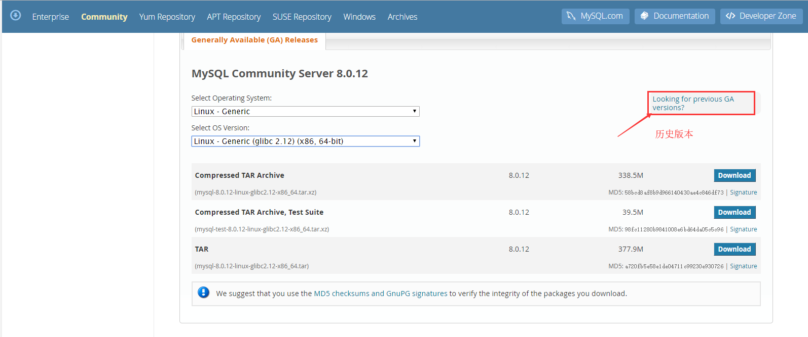
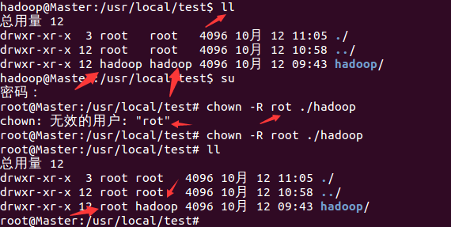

# Linux 下安装 MySQL 

最近买了个腾讯云服务器，搭建环境。

该笔记用于系统上未装过mysql的干净系统第一次安装mysql。自己指定安装目录，指定数据文件目录。

Linux系统版本： `CentOS 7.3 64位`

安装源文件版本：`mysql-5.7.21-linux-glibc2.12-x86_64.tar.gz`

mysql安装位置：`/usr/mysql`

数据库文件数据位置：`/data/mysql`

**注：** `>mysql 是mysql的命令`

## MySQL 下载

进入 [MySQL 官网](https://www.mysql.com/)，找到下载页面入口

<div align = center>

在该页面往下划对应平台系统的SQL版本

<div align = center>

比如，我下载的是 Linux 系统的历史版本MYSQL，找到历史版本入口下载即可！

<div align = center>

这里下载的是 `.tar.gz V5.7.21` 版本，下载完成后继续如下步骤：

## 安装步骤：

### 创建SQL文件夹

在根目录下创建文件夹 `mysql` 和数据库数据文件 `/data/mysql`

```profile
mkdir /usr/mysql
mkdir /data/mysql
```

### 上传MySQL安装包 

上传 `mysql-5.7.21-linux-glibc2.12-x86_64.tar.gz` 文件到 `/usr` 

- **方法一：rz命令上传文件**
- **方法二：ftp工具上传文件**
  
### 解压文件
 
```profile
cd /usr/
tar -zxvf mysql-5.7.21-linux-glibc2.12-x86_64.tar.gz
```
 
更改解压缩后的文件夹名称

```profile
mv /usr/mysql-5.7.21-linux-glibc2.12-x86_64/  /usr/mysql
```
 
### 创建 MySQL 用户组和 MySQL 用户

```profile
groupadd mysql
useradd -r -g mysql mysql
```

### 关联MySQL用户到MySQL用户组中

```profile
chown -R mysql:mysql  /usr/mysql/
chown -R mysql:mysql  /data/mysql/
chown -R mysql  /usr/mysql/
chown -R mysql  /data/mysql
```

### 更改MySQL安装文件夹 MySQL 的权限

```profile
chmod -R 755 /usr/mysql/
```

### 安装 libaio 依赖包 

安装 `libaio` 依赖包，由于我买的腾讯云服务器 `centos` 系统自带的有这个依赖包所以不需要安装，不过自带的依赖包会报错，后面介绍解决办法

查询是否暗转 `libaio` 依赖包

```
yum search libaio
# 如果没安装，可以用下面命令安装
yum install libaio
```
 
### 初始化mysql命令

```profile
cd /usr/mysql/bin
./mysqld --user=mysql --basedir=/usr/mysql --datadir=/data/mysql --initialize
```

在执行上面命令时特别要注意一行内容   

```accesslog
[Note] A temporary password is generated for root@localhost: o*s#gqh)F4Ck
```
`root@localhost:` 后面跟的是 mysql 数据库登录的 临时密码，各人安装生成的临时密码不一样

如果初始化时报错如下：
```
error while loading shared libraries: libnuma.so.1: cannot open shared objec
```

是因为libnuma安装的是32位，我们这里需要64位的，执行下面语句就可以解决

```
yum install numactl.x86_64
```
执行完后重新初始化mysql命令

### 启动mysql服务

```profile
sh /usr/mysql/support-files/mysql.server start
```

上面启动mysql服务命令是会报错的，因为没有修改mysql的配置文件，报错内容大致如下：

```
./support-files/mysql.server: line 239: my_print_defaults: command not found
./support-files/mysql.server: line 259: cd: /usr/local/mysql: No such file or directory
Starting MySQL ERROR! Couldn't find MySQL server (/usr/local/mysql/bin/mysqld_safe)
```
 
### 修改Mysql配置文件

```
vim /usr/support-files/mysql.server
```

**修改前**

```
if test -z "$basedir"
then
basedir=/usr/local/mysql
bindir=/usr/local/mysql/bin
if test -z "$datadir"
then
datadir=/usr/local/mysql/data
fi
sbindir=/usr/local/mysql/bin
libexecdir=/usr/local/mysql/bin
else
bindir="$basedir/bin"
if test -z "$datadir"
then
datadir="$basedir/data"
fi
sbindir="$basedir/sbin"
libexecdir="$basedir/libexec"
fi
```

**修改后**

```
if test -z "$basedir"
then
basedir=/usr/mysql
bindir=/usr/mysql/bin
if test -z "$datadir"
then
datadir=/data/mysql
fi
sbindir=/usr/mysql/bin
libexecdir=/usr/mysql/bin
else
bindir="$basedir/bin"
if test -z "$datadir"
then
datadir="$basedir/data"
fi
sbindir="$basedir/sbin"
libexecdir="$basedir/libexec"
fi
```

保存并退出：`:wq`

```
cp /usr/mysql/support-files/mysql.server  /etc/init.d/mysqld
chmod 755 /etc/init.d/mysqld
```

### 修改my.cnf文件

```
vim /etc/my.cnf
```
将下面内容复制替换当前的my.cnf文件中的内容

```
[client]
no-beep
socket =/usr/mysql/mysql.sock
# pipe
# socket=0.0
port=3306
[mysql]
default-character-set=utf8
[mysqld]
basedir=/usr/mysql
datadir=/data/mysql
port=3306
pid-file=/usr/mysql/mysqld.pid
#skip-grant-tables
skip-name-resolve
socket = /usr/mysql/mysql.sock
character-set-server=utf8
default-storage-engine=INNODB
explicit_defaults_for_timestamp = true
# Server Id.
server-id=1
max_connections=2000
query_cache_size=0
table_open_cache=2000
tmp_table_size=246M
thread_cache_size=300
#限定用于每个数据库线程的栈大小。默认设置足以满足大多数应用
thread_stack = 192k
key_buffer_size=512M
read_buffer_size=4M
read_rnd_buffer_size=32M
innodb_data_home_dir = /data/mysql
innodb_flush_log_at_trx_commit=0
innodb_log_buffer_size=16M
innodb_buffer_pool_size=256M
innodb_log_file_size=128M
innodb_thread_concurrency=128
innodb_autoextend_increment=1000
innodb_buffer_pool_instances=8
innodb_concurrency_tickets=5000
innodb_old_blocks_time=1000
innodb_open_files=300
innodb_stats_on_metadata=0
innodb_file_per_table=1
innodb_checksum_algorithm=0
back_log=80
flush_time=0
join_buffer_size=128M
max_allowed_packet=1024M
max_connect_errors=2000
open_files_limit=4161
query_cache_type=0
sort_buffer_size=32M
table_definition_cache=1400
binlog_row_event_max_size=8K
sync_master_info=10000
sync_relay_log=10000
sync_relay_log_info=10000
#批量插入数据缓存大小，可以有效提高插入效率，默认为8M
bulk_insert_buffer_size = 64M
interactive_timeout = 120
wait_timeout = 120
log-bin-trust-function-creators=1
sql_mode=NO_ENGINE_SUBSTITUTION,STRICT_TRANS_TABLES

 

#
# include all files from the config directory
#
!includedir /etc/my.cnf.d
```

保存退出：`:wq`

### 启动mysql

```
/etc/init.d/mysqld start
```

新版本的安装包会报错，错误内容如下：

```
Starting MySQL.Logging to '/data/mysql/SZY.err'.
2018-07-02T10:09:03.779928Z mysqld_safe The file /usr/local/mysql/bin/mysqld
does not exist or is not executable. Please cd to the mysql installation
directory and restart this script from there as follows:
./bin/mysqld_safe&
See http://dev.mysql.com/doc/mysql/en/mysqld-safe.html for more information
ERROR! The server quit without updating PID file (/usr/mysql/mysqld.pid).
```

因为新版本的mysql安全启动安装包只认 `/usr/local/mysql` 这个路径。

解决办法：

- **方法1：建立软连接**

例：
```
cd /usr/local/mysql
ln -s /usr/mysql/bin/myslqd mysqld
```
 
- **方法2、修改 `mysqld_safe`文件（有强迫症的同学建议这种，我用的这种）**

```
vim /usr/mysql/bin/mysqld_safe
```
将所有的 `/usr/local/mysql` 改为 `/usr/mysql`

保存退出 `:wq`。（可以将这个文件拷出来再修改然后替换）

### 登录MySQL

```
/usr/mysql/bin/mysql -u root –p
```
 
### 输入临时密码

临时密码就是第8条 `root@localhost:` 后面的内容 [初始化mysql命令-传送门](#初始化mysql命令)

### 修改mysql的登录密码

```
>mysql   set password=password('root');
>mysql  grant all privileges on *.* to root@'%' identified by 'root';
>mysql flush privileges;
```
 
### 完成！

此时 MySQL 的登录名root  登录密码root！

## .tar.gz 和 .tar

这里说下 `.tar.gz` 和 `.tar` 的区别：

`.tar` 只是将文件打包，文件的大小没什么变化，一般用 `tar -cvf filename.tar fileName` 格式。
`.tar.gz`是加入了 `gzip` 的压缩命令，会将文件压缩存放，可以有效压缩文件的大小，以便于缩短传输时间或者释放磁盘空间，一般用 `tar -czvf filename.tar.gz fileName`。
同样的解包的时候使用 `tar -xvf filename.tar` 和 `tar -xzvf filename.tar.gz`

## chown命令说明

Linux中有个文件所有者和群组的概念，就是对文件的权限问题，这里的文件所有者就是用户（登陆的用户）。将文件（目录）拷贝到另外一个目录（或者主机）时，需要让用户拥有此文件（目录）的权限，权限的获得通过执行chown命令来获得。

### 命令格式

`chown [选项]... [所有者][:[组]] 文件...`　　　

### 命令功能

通过chown改变文件的拥有者和群组。在更改文件的所有者或所属群组时，可以使用用户名称和用户识别码设置。普通用户不能将自己的文件改变成其他的拥有者。其操作权限一般为管理员。

### 命令参数

#### 必要参数

`-c` 显示更改的部分的信息

`-f` 忽略错误信息

`-h` 修复符号链接

`-R` 处理指定目录以及其子目录下的所有文件

`-v` 显示详细的处理信息

`-deference` 作用于符号链接的指向，而不是链接文件本身

#### 可选参数

--reference=<目录或文件> 把指定的目录/文件作为参考，把操作的文件/目录设置成参考文件/目录相同拥有者和群组

--from=<当前用户：当前群组> 只有当前用户和群组跟指定的用户和群组相同时才进行改变

--help 显示帮助信息

--version 显示版本信息

实例：使用ll命令查看目录下各个文件（目录）的所有者和群组，可以看到hadoop目录的所有者和群组群是hadoop

```
# -R指定（./hadoop）目录及其子目录下的所有文件的所有者均为root，并未修改群组
chown -R root ./hadoop
```
如果没有用户rot会给出提示，如下：

<div align = center>

## useradd -g mysql mysql解析及useradd详解

当我们在不通过yum(CentOS<redhat>)、apt-get(Ubuntu<debian>)来安装MySQL的时候，
通常执行以下命令来创建一个用户名为mysql的用户并加入mysql用户组：

```
[root@localhost ~]# useradd -g mysql mysql
```

那？这两个mysql谁是用户名谁是用户组呢？

事实上它还可以这样写：

```
[root@localhost ~]# useradd mysql -g mysql
```

第二种写法就容易理解了,对照如下:

```
#1 useradd -g mysql[用户组] mysql[用户名] 
#2 useradd mysql[用户名] -g mysql[用户组]
```

有关useradd的具体用法如下：

### 作用

useradd命令用来建立用户帐号和创建用户的起始目录，使用权限是终极用户。

### 格式

```
useradd [－d home] [－s shell] [－c comment] [－m [－k template]] [－f inactive] [－e expire ] [－p passwd] [－r] name
```
### 主要参数

`－c`：加上备注文字，备注文字保存在passwd的备注栏中。
 
`－d`：指定用户登入时的起始目录。

`－D`：变更预设值。

`－e`：指定账号的有效期限，缺省表示永久有效。

`－f`：指定在密码过期后多少天即关闭该账号。

`－g`：指定用户所属的起始群组。

`－G`：指定用户所属的附加群组。

`－m`：自动建立用户的登入目录。

`－M`：不要自动建立用户的登入目录。

`－n`：取消建立以用户名称为名的群组。

`－r`：建立系统账号。

`－s`：指定用户登入后所使用的shell。

`－u`：指定用户ID号。

### 说明
`useradd` 可用来建立用户账号，他和 `adduser` 命令是相同的。账号建好之后，再用 `passwd`设定账号的密码。使用 `useradd`命令所建立
的账号，实际上是保存在 `/etc/passwd`文本文件中。

### 应用实例

建立一个新用户账户，并设置ID：

```
useradd kang -u 588
```

需要说明的是，设定ID值时尽量要大于500，以免冲突。因为Linux安装后会建立一些特别用户，一般0到499之间的值留给bin、mail这样的系统账号。

新创建一个kang用户，它既属于mysql组，同时也属于dba组。

```
useradd kang -g mysql -G dba
```

指定mysql用户登录时的初始目录。

```
useradd mysql -d /usr/local
```

## 在linux中，安装mysql，并创建用户组mysql的作用

让mysql运行的时候使用一个独立的账号，如果mysql被黑了那么开始拿到的权限就是那个创建的账号而不是默认的root。

我们在编译安装的时候创建一个mysql组和一个mysql用户，并把datadir和安装目录属主改为mysql，
在MySQL启动的时候，单进程mysqld，该进程的属主就是mysql，这样就保证了mysql服务的独立性，
即便mysql服务被黑掉，得到了mysql用户权限，也不会影响整个系统的安全

---

参考资料：[linux安装mysql详细步骤](https://www.cnblogs.com/shizhongyang/p/8464876.html)
[chown命令](https://www.cnblogs.com/lz3018/p/4871391.html)