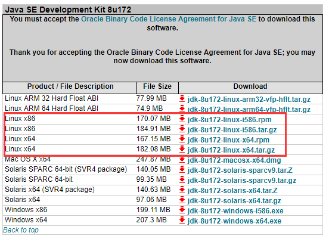
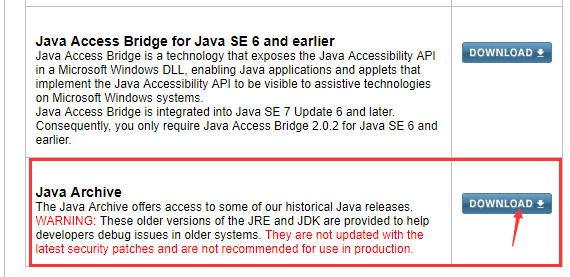
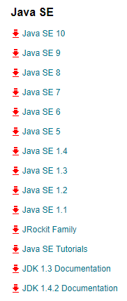

# Linux 环境下 JAVA 环境变量配置

这里以 **JDK8** 为例，首先在 Linux 中输入如下命令，检验 Liiinux 系统版本信息：

```
# 检验 Linux 系统版本信息
uname -a
```

如果输出结果包含有 `X86_32` 表明系统是 `64` 位，如果出现 `i686` 则说明是 `32` 位操作系统。

进入 [oracle 官网](https://www.oracle.com/) 下载对应操作系统的 JDK 8 版本：

<div align = center>

另外，如果想下载历史版本 JDK 则需要在下载页面找到 JDK 归档栏：

<div align = center>

点击归档后既能看到所有 JDK 版本，点击下载即可！

<div align = center>

## 登录Linux，切换到 rooot 用户

如果当前已是 root 用户不需要变更。否则：

```
# 获取root用户权限，当前工作目录不变（需要 root 密码）
su root
# 或则使用该命令如下命令，该指令不需要 root 密码直接切换成 root（需要当前用户密码）
sudo -i
```

## 建立 JDK 安装目录

这里直接在 `/usr` 目录下建立JDK安装目录：

```
# 创建 JVM 目录
mkdir jvm
```

将下载的 JDK8 上传至该目录下

### 命令上传

```
# 在 JVM 目录下输入该指令
rz
```

**说明：** `rz` 指令是上传文件的意思，执行该命令后，在弹出框中选择要上传的文件即可。`sz fileName` 执行该命令后，是将 fileName 文件发送到本地。
另外，如果提示 `unknown rz command` 则说明没有安装该指令，只需要输入如下命令安装即可：
```
# 安装 lrzsz
yum install -y lrzsz
```

### 使用 ftp 上传

如果使用的是 Xshell ，可直接借助 ftp 上传文件即可。

---

文件上传完成后输入 `ls` 指令即可看到在 `/jvm` 下看到该文件：

```
cd jvm
ls
#会看到该文件： jdk-8u60-linux-x64.tar.gz
```

## 解压 JDK 到当前目录

```
# 将文件压缩包解压到当前目录
tar -zxvf jdk-8u60-linux-x64.tar.gz
```

会得到 `jdk1.8.0_60` 目录。

## 配置环境变量

JDK 安装完成后进入 `/etc` 目录编辑 `profile` 文件

```
cd /etc
vim profile
```

在该文件中添加如下配置信息：

```
# 添加 JVM 环境变量
JAVA_HOME = /usr/jvm/jdk1.8.0_60
CLASSPATH = ${JAVA_HOME}/lib
PATH      = ${JAVA_HOME}/bin
export JAVA_HOME CLASSPATH PATH

# 或者如下方式
export JAVA_HOME = /usr/jvm/jdk1.8.0_60
export CLASSPATH = ${JAVA_HOME}/lib
export PATH      = ${JAVA_HOME}/bin
```

环境变量配置完成后输入如下指令

```
# 立即重启机器
sudo shutdown -r now
# 或者直接输入如下指令生效配置文件
source /etc/profile
```

再检验 JDK，看是否配置完成

```
java -version
得到如下信息即表示完成
java version "1.8.0_60"
Java(TM) SE Runtime Environment (build 1.8.0_60-b27)
Java HotSpot(TM) Client VM (build 25.60-b23, mixed mode)
```