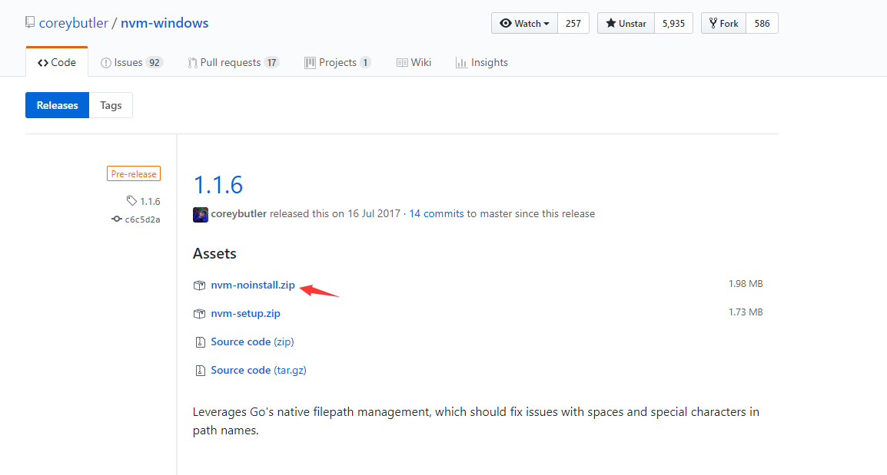
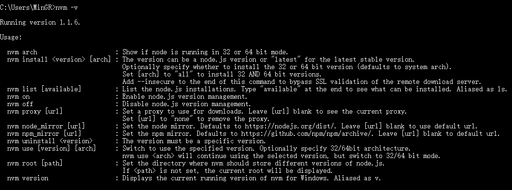
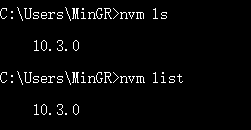
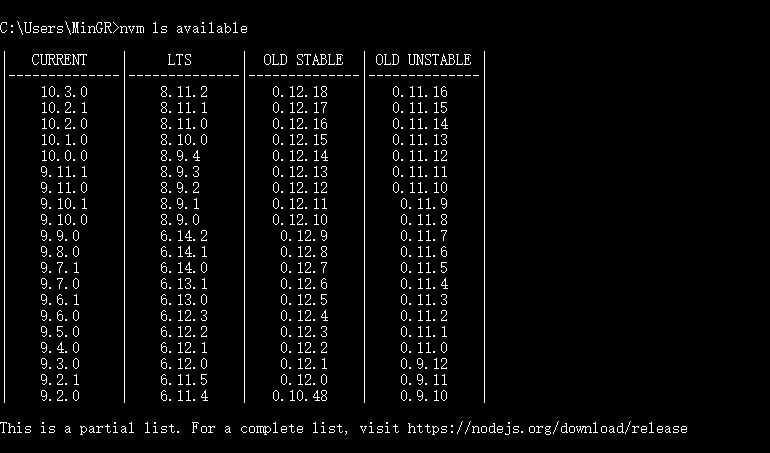

<!-- TOC depthFrom:1 depthTo:6 withLinks:1 updateOnSave:1 orderedList:0 -->

* [node中nvm的安装-采坑集合](#node中nvm的安装-采坑集合)
	+ [nvm是什么](#nvm是什么)
	+ [下载安装与使用](#下载安装与使用)
		- [nvm 下载](#nvm-下载)
		- [nvm 安装](#nvm-安装)
		- [nvm 环境变量配置](#nvm-环境变量配置)
		- [nvm基本操作](#nvm基本操作)
		- [安装node](#安装node)

<!-- /TOC -->

### node中nvm的安装-采坑集合

#### nvm是什么

> Node版本的迭代速度很快，版本很多，不同项目对 node的依赖不同，故需要切换不同node版本
> 
>目前有n和nvm这两个工具可以对Node进行无痛升级，n 命令是作为一个 node 的模块而存在，而 nvm 是一个独立于 node/npm 的外部 shell 脚本，因此 nvm 命令相比 n更加全面，n更有局限性。

> nvm 是 Mac 下的 node 管理工具，有点类似管理 Ruby 的 rvm，如果是需要管理 Windows 下的 node，官方推荐是使用 nvmw 或 nvm-windows 。

> 我按nvm提供的文档来完成nvm及node多个版本的安装,因为在安装过程中遇到不少坑,特在此总结安装中遇到的各种坑

#### 下载安装与使用
##### nvm 下载
> nvm-windows下载地址：[nvm-windows](https://github.com/coreybutler/nvm-windows)
> 
> 
>
>选择第一个 nvm-noinstall.zip ，然后解压在系统盘（建议放D盘）。我放的目录路径是 `D:\NodeNVM\nvm`c。解压出来的文件有：
>
 +  elevate.cmd
 +  elevate.vbs
 +  install.cmd
 +  LICENSE
 +  nvm.exe
备注：windows下要设置显示文件类型的扩展名，这样才能看到上述文件的后缀

##### nvm 安装
>双击 install.cmd ，是以控制台形式显示的，第一下直接按回车，然后会在d盘根目录产生settings.txt，把这个文件放进刚刚解压的那个目录，然后修改settings.txt内容，改成如下：
>
`root: D:\NodeNVM\nvm` 
`path: D:\NodeNVM\nodejs `
`arch: 64 `
`proxy: none`
>
倘若上面方法行不通，因为打开 `install.cmd` 按下回车后，显示拒绝访问注册表路径，并弹出一个 `settings.txt` 。此时只需要淡定的关掉控制台及文本，看当前盘根目录是否产生一个 `settings.txt`。将改文件直接拷贝进入 `D:\NodeNVM\nvm` 目录里或 直接在`D:\NodeNVM\nvm` 新建一个文件 `settings.txt` ，然后复制上面的内容即可。
>
`root `： nvm的存放地址
`path `： 存放指向node版本的快捷方式，使用nvm的过程中会自动生成。一般写的时候与nvm同级。
`arch `： 电脑系统是64位就写64,32位就写32
`proxy `： 代理

##### nvm 环境变量配置

>以控制台方法执行成功的，在环境变量里会自动配置了 `NVM_HOME` 和 `NVM_SYMLINK` 。

>直接创建 `settings` 文件的可以在环境变量里创建 `NVM_HOME` 和 ` NVM_SYMLINK` ，并添加路径。

>若环境变量配置有问题，可以直接按下面两种方式来手动配置

>第一种：右键单击 我的电脑 - 属性 - 高级系统设置 - 高级 -环境变量 - 系统变量 中新建，输入对应变量名，变量值即可
>
`NVM_HOME`： `D:\NodeNVM\nvm`
`NVM_SYMLINK` ：`D:\NodeNVM\nodejs`
>
第二种：`windows+r` 弹出输入框后，输入： `sysdm.cpl` ，同第一种 高级 以后的操作（步骤稍微简单一点点）

>最后在上面的用户变量中的PATH里加上

> `;%NVM_HOME%;%NVM_SYMLINK%;` 。

##### nvm基本操作

>打开cmd窗口输入命令：nvm -v ，查看当前nvm的版本信息。
>
>
>
`nvm install latest` // 下载最新的 node 版本 v7.2.0
`nvm install 8.5.0` // 安装不同版本
`nvm install 6.11.3 32`  // 默认是64位，32位需指定
>
备注： 如果你的电脑系统是32 位的，那么在下载nodejs版本的时候，一定要指明 32 如： `nvm install 5.11.0 32`  这样在32位的电脑系统中，才可以使用，默认是64位的。
>
`nvm uninstall 6.11.0` #卸载对应的版本
`nvm use 8.5.0` // 引入使用
`nvm list/ls` // 查看已安装的 node 版本
>
>
>
`nvm ls available` //列出远程服务器上所有的可用版本
>
>
>
>**eg:**
 -  8.5.0
 -  8.0.0
 -  6.11.3 (Currently using 64-bit executable)
  * 表示当前正在使用的node版本号
  * 每次执行切换的时候，系统都会把 node 的可执行文件链接放到特定版本的文件上。

##### 安装node

>第一个坑：
>安装过node版本的,先卸载了在开始看现在的安装流程。

>第一种方式：
使用命令行下载，直接输入：`nvm install [版本号]`
>
`nvm install 6.11.0`
要下载最新版的可以直接输 `nvm install latest`
下载完成后，在控制台输入：`nvm use [版本号]`
>
`nvm use 6.11.3`
//下面会显示如下内容
Now using node v6.11.3 (64-bit)
>
//查看node版本是否是自己需要的
`node -v`
//显示当面使用版本号即表示没毛病了
`v6.11.3`
第二种方式：
直接上官网下载所需安装包

-----------------------
>第二个坑：
>刚开始我是用命令行的方式安装的node所需版本，但是安装的node启动项目一直有问题，后同事告知命令行下载的版本很可能丢失文件，导致各种奇怪的问题，直接去官网下载安装包按下面操作流程即可。
>
*  下载安装包之后，将文件解压到 `D:\NodeNVM\nvm` 中
* 重命名，按原文件名更改为如下所示即可（严格按如下方式更改名字）
//原文件名 => 新文件名
`node-v8.0.0-win-x64 => v8.0.0`
所需要node下载完成后，按上面方式查看、切换版本
>
如果你是第一次下载，在use之前，`D:\NodeNVM` 目录下是没有nodejs这个文件夹的，在输入比如： `nvm use 6.11.3` 之后，你会发现，`D:\NodeNVM` 目录下多了一个nodejs文件夹，这个文件夹不是单纯的文件夹，它是一个快捷方式，指向了 `D:\NodeNVM\nvm` 里的  `v6.11.3` 文件夹。
>
同样的咱们可以下载其他版本的nodejs，这样通过命令:nvm use 版本号 比如：`nvm use 5.11.0` 就可以轻松实现版本切换了。
>
**注意：**切换不同的node版本以后，用管理员身份打开命令行，运行 `npm -g -d i windows-build-tools` ，以解决window中某些不能用的命令的问题
>
**安装 cnpm**

>因为npm安装插件是从国外服务器下载，受网络影响大，可能出现异常,所以可以使用淘宝开发的淘宝NPM镜像，同步频率目前为 10分钟 一次。
>
> 1.  通过 config 配置指向国内镜像源
> `npm config set registry http://registry.cnpmjs.org` //配置指向源
> `npm info express`  //下载安装第三方包
> 2.  通过 npm 命令指定下载源
> `npm --registry http://registry.cnpmjs.org info express`
> 3.  在配置文件 `~/.npmrc` 文件写入源地址
> `nano ~/.npmrc`   //打开配置文件
> `registry = https://registry.npm.taobao.org` //写入配置文件
> `npm install -g cnpm --registry=https://registry.npm.taobao.org`
> `npm install -g cnpm --registry=http://r.cnpmjs.org`
三.使用node启动项目
> `npm i` （npm install 的简写）安装依赖时候，后面加上 `-d` 可以看到文件安装进程和状态
若安装文件中出现状态304且报错，直接去 `D:\NodeNVM\npm-cache` 中，将缓存文件全部删除
>

-----------
>第三个坑：第三个坑与nvm无关，是在查找资料时候我习惯打开蓝灯，但是蓝灯会修改电脑上的一些配置，导致关机重启后，无法顺利连上网。所以用蓝灯的用户，记得开机后启动蓝灯。

原文链接：[简书](https://www.jianshu.com/p/d227e11af3f9)
